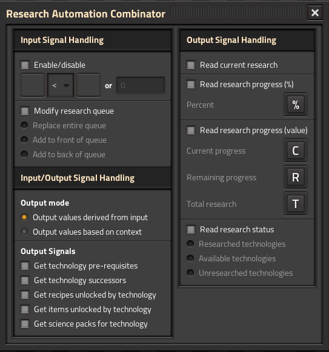

# Research Automation Combinator

Automate your research process with an advanced combinator that can query, monitor, and control Factorio's research system. Input technology signals to get recipes, items, prerequisites, successors, and science pack requirements. Use the combinator to dynamically manage your research queue based on circuit network conditions.

## Installation

[Download on the Mod Portal.](https://mods.factorio.com/mod/research-automation-combinator)

## Features

### Query Technology Information

Use technology signals as input to query detailed information about technologies:

- **Get technology prerequisites** - Output the technologies that must be researched before a given technology
- **Get technology successors** - Output the technologies that can be researched after a given technology
- **Get recipes unlocked by technology** - Output all recipes that are unlocked by a given technology
- **Get items unlocked by technology** - Output all items/fluids that are unlocked by a given technology
- **Get science packs for technology** - Output the science packs required to research a given technology

### Control Your Research Queue

Modify your research queue based on circuit network signals:

- **Replace entire queue** - Clear the research queue and add the input technologies to it
- **Add to front of queue** - Insert the input technologies at the front of the research queue
- **Add to back of queue** - Append the input technologies to the end of the research queue

### Monitor Current Research

Track the research that's currently active:

- **Read current research** - Output the technology that is currently being researched
- **Read research progress (%)** - Output the current research progress as a percentage (0-100)
- **Read research progress (value)** - Output the current, remaining, and total research progress as numeric values

### Query Research Status

Get information about technology states:

- **Read research status** - Output technologies grouped by their research state:
  - Researched technologies (completed)
  - Available technologies (all prerequisites met, ready to research)
  - Unresearched technologies (not yet researched)

### Flexible Output Modes

Choose how output signal values are determined:

- **Output values derived from input** - Output values match the input signal values. Useful for multiplexing multiple input signals through the combinator
- **Output values based on context** - Output values are based on the technology's properties:
  - For technologies: outputs the technology level (useful for infinite technologies)
  - For recipes/items: outputs a value of 1
  - For science packs: outputs the required count per research increment

### Enable/Disable Based on Conditions

Use the input condition to enable or disable the combinator based on circuit network signals. When disabled, the combinator will not process input signals or modify the research queue.

## Usage Tips

1. **Multiplexing Input Signals** - Send multiple technology signals to the combinator at once to query multiple technologies in a single tick. The combinator will combine results from all input technologies.

2. **Conditional Research** - Set the current research based on which science packs are available.

3. **Technology Relationships** - Use prerequisites and successors queries to build adaptive research systems that automatically research required technologies.

## License

MIT License

---

Created by nightingale for Factorio 2.0+
